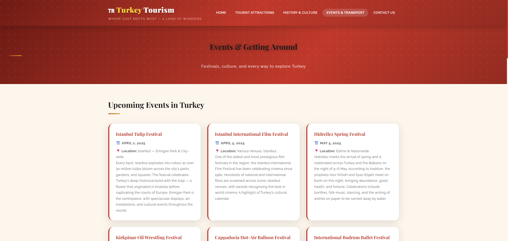

# 🇹🇷 Turkey Tourism Website

✏️ A modern and responsive website to explore the beauty, history, and culture of Turkey ❗

## 🚀 Project Overview
This project is a complete modernization of a tourism portal. Originally designed for Oman, it has been fully updated for Turkey with:
- **Modern Design:** Glassmorphism, CSS Grid, and Poppins typography.
- **Enhanced Security:** Fully transitioned to **PHP PDO** and prepared statements to prevent SQL injection.
- **Dynamic Content:** Real-time data fetching for Turkish attractions and events.

---

## 📸 Screenshots

### ➡️ Home Page
The homepage features a modern sticky navigation and a high-definition banner with a glassmorphism overlay. It introduces the "Bridge between East and West".

### ➡️ Tourist Attractions
Displays Turkey's world-renowned landmarks like Ephesus and Cappadocia using a dynamic grid system.

### ➡️ 5-Day Itinerary
A structured travel guide covering Istanbul, Pamukkale, and Central Anatolia.

### ➡️ History & Culture
A dedicated section with an automated image slider and embedded video content showcasing Turkey's imperial past.

### ➡️ Events & Transportation
Provides a live list of Turkish festivals and detailed guides on using the YHT High-Speed trains and Istanbulkart.

---

## 🛠️ Technical Details
- **Backend:** PHP 8.2+ using **PDO** for secure database communication.
- **Database:** MySQL for storing attraction details and event schedules.
- **Frontend:** HTML5, Modern CSS (Variables & Flexbox), and Vanilla JavaScript for the UI animations.

## ⚙️ How to Run Locally
1. Clone the repository to your `htdocs` folder.
2. Create a MySQL database named `turkey_tourism`.
3. Import the table structures provided in the documentation.
4. Open `http://localhost/turkey_tourism/` in your browser. 
