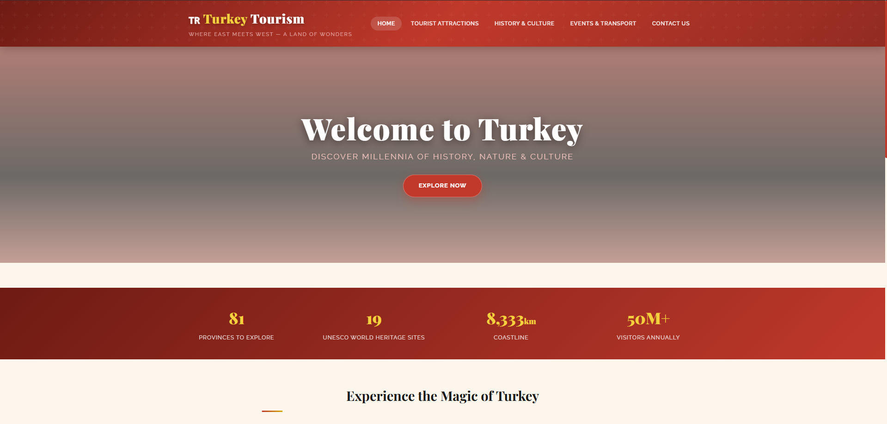
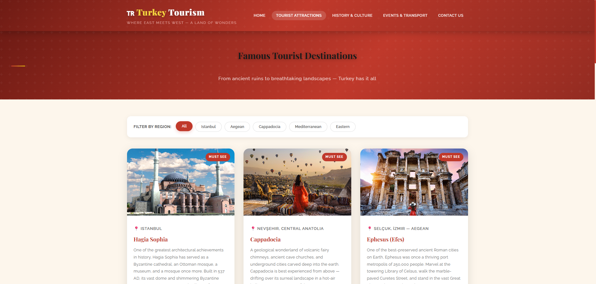
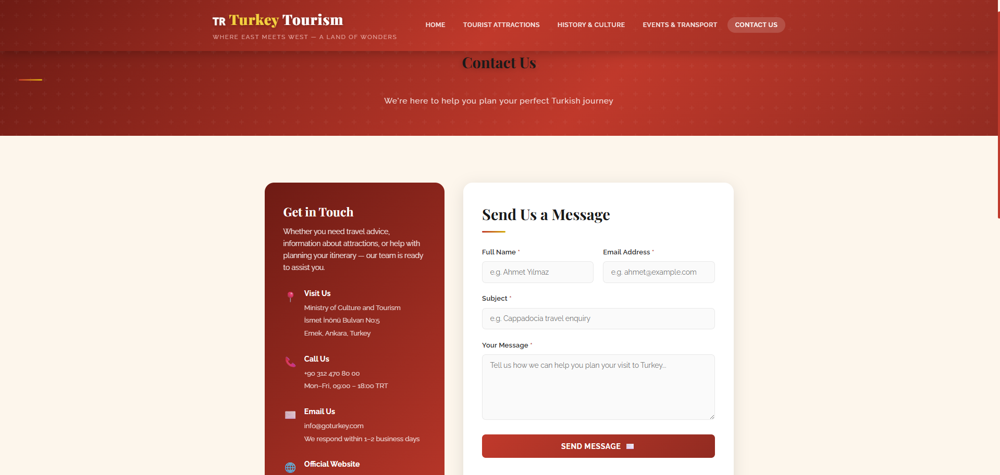
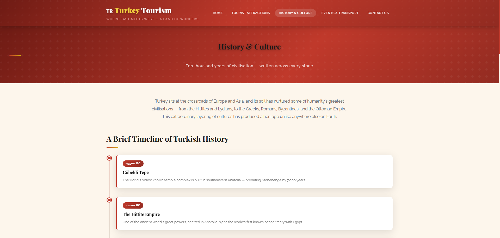

# 🇹🇷 Turkey Tourism Website

## 📸 Screenshots

### ➡️ Home Page

### ➡️ Tourist Attractions

### ➡️ Contact Us

### ➡️ History & Culture

### ➡️ Events & Transportation

---

## ⚙️ How to Run Locally
1. Clone the repository to your `htdocs` folder.
2. Create a MySQL database named `turkey_tourism`.
3. Import the table structures provided in the documentation.
4. Open `http://localhost/turkey_tourism/` in your browser. 
